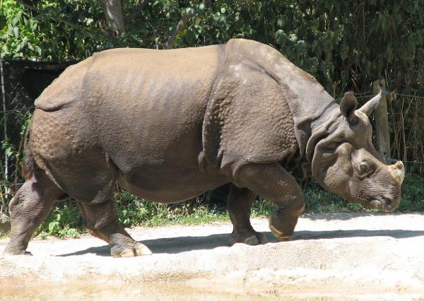
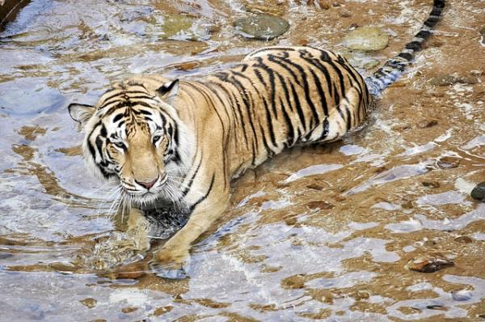
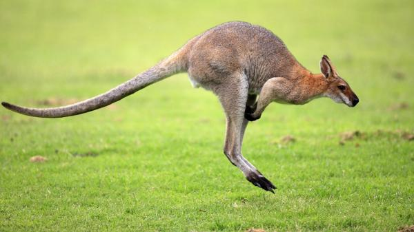
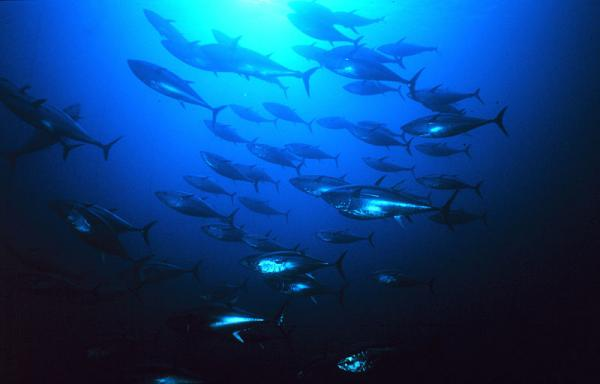
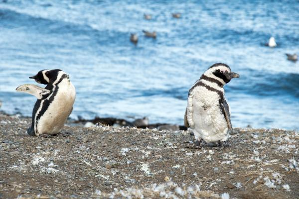
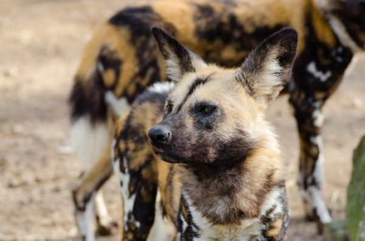

<html>
<head>
<title>
mi primera pagina web
</title>
</body>
<body background="fondo.jpg" bgcolor="black" text="white">
<h1>𝓛𝓸𝓼 𝓐𝓷𝓲𝓶𝓪𝓵𝓮𝓼 𝓮𝓷 𝓹𝓮𝓵𝓲𝓰𝓻𝓸 𝓭𝓮 𝓮𝔁𝓽𝓲𝓷𝓬𝓲𝓸𝓷</h1>
<h2> Lamentablemente, hoy en día son muchas las especies en peligro de extinción.
 Muchas de ellas debido a la acción del hombre y el cambio climático global lo que resulta igualmente un efecto indirecto de las actividades del ser humano.
 Algunas de estas especies en peligro ya están condenadas a desaparecer de aquí a unos años y aunque hay muchas organizaciones que trabajan por preservarlas,
 día a día siguen sufriendo.

 </h2>

<h1></h1>

<tr>
<table border="1">
<td colspan="2"><h1> Rinoceronte de java</h1></td>

</tr>
<tr>

<table border="1" width="90%">
<td>Seguimos esta lista de animales en peligro de extinción en el mundo hablando sobre una
 especie de rinoceronte. Resulta muy dramática la situación en la que se encuentra el 
rinoceronte de Java (Rhinoceros sondaicus), no solo porque ya quedan muy pocos
 ejemplares y según la IUCN Red List of Threatened Species se encuentra en estado crítico
 de peligro de extinción, sino por la razón principal que los empuja a su desaparición: la
 caza para convertirle en adorno o la creencia, en China y en culturas orientales, de que su
 cuerno tiene propiedades curativas. La caza, en general, tiene efectos muy negativos para los
 animales, más aún en determinadas especies.

</h2>

<h1>Los tigres especie en gran peligro de extinción
</h1>
<h3>Esta es otra de las especies animales en mayor peligro de extinción en Asia y en el mundo.
 Se dice que hay menos de 4.000 tigres (Panthera tigris) en el mundo que viven en su hábitat natural
 y su supervivencia está cada vez más amenazada, sufriendo más en los últimos años.
 De nuevo la caza es el elemento principal que ha impulsado a ello, aunque también influye la deforestación
 una consecuencia indirecta de la acción del ser humano. El tigre de Java y el de Bali ya se extinguieron y
 a pesar de que su carne no se usa habitualmente para la nutrición los tigres se cazan para aprovechar su piel
 que se paga a altos precios en el mercado Dos de las subclases más amenazadas son los tigres de Bengala y los tigres de Amoy o Xiamen.</h3>

<h1>El canguro en peligro de extinción
</h1>
<h3>El canguro de la familia Macropodidae es un animal australiano del cuál se come su carne
 y también se exporta a otros lugares para su consumo así como objetivo de actividades
 turísticas de la caza furtiva etcétera Además a pesar de su caza este marsupial sufre sobre
 todo los efectos del calentamiento global Podría desaparecer en unos años según
 expertos Si las temperaturas siguiesen aumentando en los próximos años los canguros 
podrían estar condenados a desaparecer en unos años pues su población va descendiendo
 poco a poco por lo comentado y por el aumento de las temperaturas a mayor ritmo podría 
empeorar drásticamente en poco tiempo.

</h3>
<h1> El atún rojo
</h1>
<h3>Este pez migratorio, llamado Thunnus thynnus, se suele encontrar en el Atlántico 
y el mar Mediterráneo ha dado síntomas de debilidad en los últimos años
 ¿El motivo de que esté este animal en peligro de extinción? La utilización del atún rojo
 en el sushi de calidad del mercado  existe una prohibición temporal para dejar de consumirlo de manera tan abusiva
 de lo contrario, podría desaparecer

<h1>Los pingüinos
 </h1>
<h3>Aunque todavía hay bastantes ejemplares los pingüinos (Spheniscidae) también sufren las
consecuencias del deshielo y el calentamiento global Son animales que migran y muchos
están muriendo por el camino Por ello algunas de sus especies ya han entrado en la lista de
los animales en mayor peligro de extinción con mayor riesgo en zonas concretas del planeta 
como el polo Sur.

<h1>El perro salvaje africano en peligro de extinción
</h1>
<h3>El licaón perro salvaje africano o Lycaon pictus es otra de las especies animales en mayor
 peligro de extinción en el mundo Según la IUCN Red List los licaones o perros salvajes
 africanos están en peligro de extinción y además según los datos más recientes
 recogidos por la entidad su población sigue disminuyendo.

</h3>

</td>
</table>

</body>
</html>
